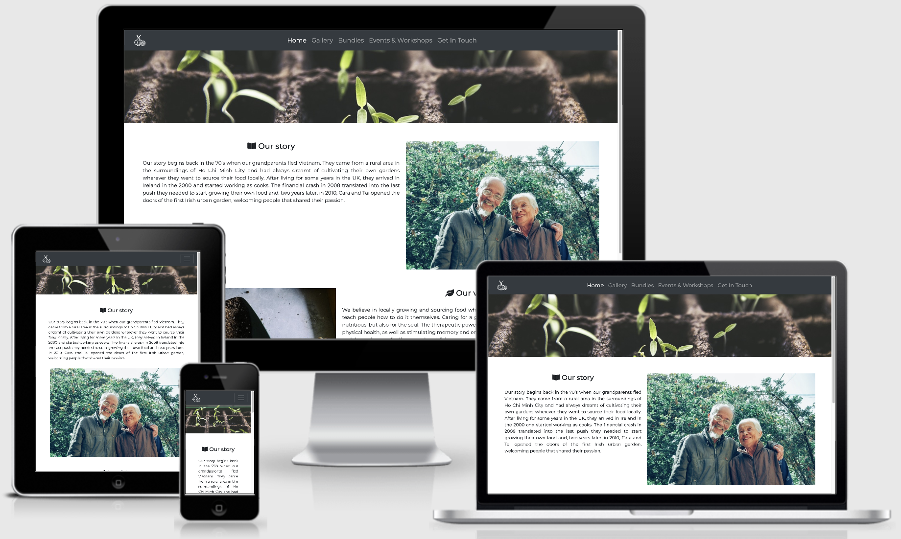

<h1 align="center">You Plant It</h1>

[View the live project here.](https://github.com/MihaelaVacarus/MS1-You-Plant-It)

**You Plant It** is the official website for Milestone Project 1. Designed to be responsive on all sort of devices, the advertised product sells potential customers the possibility of having their own urban garden in Dublin city.

<h2 align="center"></h2>

## User Experience (UX)

-   ### User stories
    - #### As a user, I want to look up urban gardens in Dublin so that I can maybe grow my own.
    - #### As a user, I want to see what can be planted so that I can get the fruit and veggies that I like.
    - #### As a user, I want to check how much that's going to cost me.
    - #### As a user, I want to meet people with similar interests so that we share ideas.
    - #### As a user, I want to maybe join a workshop so that I learn more about the gardening basics.
    - #### As a user, I want to be able to contact the company by sending an email/form, so that I am not bothered with calls.
    
-   ### The five elements of user experience
    - #### The **strategy** plane. The focus is renting out urban garden spaces in Dublin, so for that I am creating a website. For the users, the site will provide information on how to get started with growing their own garden in the city, the community and events around it and the convenience of learning new skills while at it. For us as a company, we will get an online presence to display our services and increase rentals throughout different techniques.
    - #### The **scope** plane. Features to be included: request more information form, photos gallery, downloadable activities calendar, send request for information form. Content will span from bundles section with information on pricing and what's included, events on social media such as creating healthy recipes with own products to engage users and information on available workshops to learn more about gardening. 
    - #### The **structure** plane. On the top side of the website the logo will be aligned in the upper left corner and moving along the line, the fixed navigation bar will be centered and contain five sections: ***Home, Gallery, Bundles, Events & Workshops and Get In Touch***. Each section follows an intuitive approach for the user and easily meets expectations by following a similar design. The content is minimalistic, yet informative enough. 
    - #### The **skeleton** plane 
        [Wireframes](assets/docs/ms1-wireframes.pdf)
    - #### The **surface** plane. For the font, I have chosen Montserrat Google font with a Sans Serif fallback. Favicon will be added and based on the logo to create cohesion and visual reassurement for the users.

-   ### Design
    - #### Color Scheme 
        - Throughout the website, there is a consistent use of contrast of dark and white. 
    - #### Typography
        - Montserrat Google font with Sans Serif as the fallback font has been used. 
    - #### Imagery 
        - All pages feature a colorful hero image of a plant. Exceptionally and intentionally, this has not been included in the Gallery page to avoid visual overload for users. In addition, many icons have been included throughout the pages in order to convey meaning and/or support the content.

-   ### [Wireframes](assets/docs/ms1-wireframes.pdf). 
    Some small changes have been made to the original wireframes:
    - #### **Home** 
        - In the original wireframe, for the navigation menu, the logo is centered. Upon doing some research online for best UX, I learned that logos are usually placed on the left and navigation menus are on the right. I decided to keep move the logo on the left, but keep the menu centered because I found it aesthetically pleasing and coherent with the centered content in the other pages.
        - The chronology and callout button have also been replaced by two sections detailing what the founders' story is and their vision for the product. This is because I realized in this type of business a chronology would not make much sense because of the brief history they have. Regarding the callout, I figured it would make more sense to have it afterwards, in the other pages, once the user has a chance to skim through the content.
    - #### **Gallery**
        - For the mobile view, a carousel would be difficult to visualize, so I have changed it in a way pictures are stacked on top of each other on smaller devices.
        - The hero image I decided to take out because there are many pictures on this page, and it would be too much all together.
    - #### **Bundles**
        - Bundles now are introduced by a small paragraph with an icon and below them a line has been included to display information on how to learn more about the prices and link to contact form.
    - #### **Events & Workshops**
        - Another download button has been included for the events. This way, users can check either events or workshops that open in a new tab, while browsing other pages on the main website.
        - Additionally, each card now includes an image on top to avoid that much text.
    - #### **Get in Touch**
        - For this section, I included the location of the gardens and a phone number with direct links to GoogleMaps and Whatsapp respectively.
        - The title of the section has been changed to "Leaf us a comment".
        - The "Send" button has been aligned to the left, in line with the content.

## Features
-   Responsive on all device sizes

-   Interactive elements

## Technologies Used

### Languages Used

- [HTML5](https://en.wikipedia.org/wiki/HTML5)
- [CSS3](https://en.wikipedia.org/wiki/CSS)

### Frameworks, Libraries & Programs Used

1. [Bootstrap v4.5](https://getbootstrap.com/docs/4.5/getting-started/introduction/):
    - Bootstrap was used to design several elements on the pages as well as help with styling and responsiveness.
2. [Hover.css](https://ianlunn.github.io/Hover/):
    - Hover.css was used for the social media icons, the images in the gallery section and the "Send" button for the contact form.
3. [FreeLogoDesign](https://www.freelogodesign.org/):
    - FreeLogoDesign was used to create the website's logo.
4. [Favicon.ico & App Icon Generator](https://www.favicon-generator.org/):
    - Favicon has been used to generate the favicon based on the logo image.
5. [Google Fonts](https://fonts.google.com/):
    - Google font Montserrat was chosen for the website and imported to the stylesheet. 
6. [Font Awesome](https://fontawesome.com/):
    - Font Awesome was used throughout the pages to illustrate and complement content, as well as improve UX.
7. [JavaScript](https://www.javascript.com/):
    - Specific JS components provided by Bootstrap scripts were included so the elements used were responsive.
8. [Git](https://git-scm.com/):
    - Git was used for version control.
9. [GitHub](https://github.com/):
    - GitHub was used to store the project's code.
10. [Balsamiq](https://balsamiq.com/):
    - Balsamiq was used to create the [wireframes]((assets/docs/ms1-wireframes.pdf)) during early stages of the design process.
11. [Pexels](https://www.pexels.com/):
    - All the images found on the site have been sourced from Pexels.

## Testing
The W3C Markup Validator and W3C CSS Validator Services were used to validate every page of the project to ensure there were no syntax errors in the project.
- [W3C Markup Validator](https://validator.w3.org/#validate_by_input)
The results of this validation show a warning that the first sections in index, bundles, activities and contact don't have a heading. However, I ignored those as the actual headings are contained in the code in the subsequent sections.
- [W3C CSS Validator](https://jigsaw.w3.org/css-validator/)

### Testing User Stories from User Experience (UX) Section

- #### As a user, I want to look up urban gardens in Dublin so that I can maybe grow my own.
    -  The website is optimized for SEO search through meta keywords that help user land on my page. 

- #### As a user, I want to see what can be planted so that I can get the fruit and veggies that I like.
    - Right when entering the homepage, the content in the story and vision sections help the user understand that the gardens that are grown are mainly for sourcing fruit and vegetables.
    - The Gallery page reinforces the idea by showing a series of images of tomatoes, zucchinis, strawberries and other produce.
    - The Bundles page also offers a pack of organic seeds for veggies in each package.
    - Finally, in the PDF contained in the Workshops section, there are details about a coming talk on cultivating tropical fruit.
- #### As a user, I want to check how much that's going to cost me.
    - Information regarding prices can be requested by the user via social media, Whatsapp message and/or contact form. This is mentioned right below the bundles that we offer.
    - Specific prices were not included, as the type of user who is looking to rent a space for a garden in the city, would probably not care as much about the price, but rather about the services being offered.
- #### As a user, I want to meet people with similar interests so that we share ideas.
    - The vision section on the homepage, already hints that gardening helps with socialising.
    - The social media links present on all pages prompt people to follow us and engage in the conversations on social media.
    - The events section on the activities page are designed to bring the community together.
    - The PDF contained in the workshops section mentions that, after the workshops, there is usually drinks at a local pub for people to get together.
- #### As a user, I want to maybe join a workshop so that I learn more about the gardening basics.
    - The Events & Workshops page includes a section on courses with a designed PDF that covers all necessary info.
- #### As a user, I want to be able to contact the company by sending an email/form, so that I am not bothered with calls.
    - The Contact page has a contact form that allows users to ask for information without giving their phone number.
    - Additionally, on that same page, users are given the option to send a Whatsapp message directly from the website, and so inquire for more info.

### Further testing 

- The Chrome extension [Responsive Viewer](https://chrome.google.com/webstore/detail/responsive-viewer/inmopeiepgfljkpkidclfgbgbmfcennb?hl=en) has been run and checked.
- The [Am I Responsive](http://ami.responsivedesign.is/) website has been used to ensure responsiveness.
- Run style sheet code through [Autoprefixer CSS online](http://autoprefixer.github.io/) and pasted prefixed code back into the style sheet.
- The website has been checked on several devices such as large desktop, laptop, Iphone phones (from 5 to 11) and several Android phones.
- The website has been opened on Safari, Chrome and Mozilla both on phones and laptops to check for any display issues across browsers.
- Family and friends have been asked to provide feedback and click around to flag any potential major issues.

### Manual testing 

- #### Below points have been checked as common to all pages:
    - Navigation bar links work to and from all pages, both on mobile and large screens. So do the added effects when hovering over.
    - Footer always stays at the bottom and social media links redirect to the sites correctly.
    - Hero image (except on Gallery page) has an appropriate size and displays correctly with no overlaps.
- #### Home:
    - Text is of an appropriate size and nicely readable for both mobile and large devices.
    - Images are displaying only on large and extra large screens, as predicted. 
    - Icons balance out the proportions between text and imagery.
- #### Gallery:
    - The gallery is responsive on all devices and displays with all effects as expected.
    - Spacing is appropriately used in order not to overload users.
    - Minimalistic effect is achieved by delivering a clean and neat portrayal of the activities in the gardens.
- #### Bundles:
    - Responsiveness across devices is suitable for reading.
    - Link to contact form redirects just fine.
    - Use of icons helps with breathability across the used space. 
    - Font size is appropriate.
- #### Events & Workshops:
    - Responsiveness across devices is suitable for reading.
    - PDFs for both sections open correctly in a new tab.
    - The content in the PDFs is coherent with the branding and color scheme used on the website.
    - Content is appropriate and conveyed with a suitable font size. 
    - Buttons style is minimalistic and coherent with the style used throughout the rest of the website. 
- #### Get In Touch:
    - Sections are fully responsive on all sort of devices.
    - Link to location redirects correctly to GoogleMaps.
    - Link to Whatsapp redirects correctly to Whatsapp with a prefilled message asking for more info.
    - Content is appropriate and includes time zone for users accessing the site from other countries.
    - Form requests all fields as mandatory in order to be sent.
    - Button style is big to be easily clicked on mobile and style is minimalistic and coherent with the rest of buttons.

## IDE and version control
The project has been written in [Gitpod](https://www.gitpod.io/) and I have used [Git](https://git-scm.com/) for version control.

## Deployment

### GitHub pages

The project was deployed to GitHub Pages using the following steps:

1. Log in to GitHub and locate the [project's repository](https://github.com/MihaelaVacarus/MS1-You-Plant-It).
2. Click on the Settings button and scroll down until the GitHub Pages section.
3. Under source, in the Branch dropdown, select "Master" and click Save. 
4. In the same location, right after, the link to the live page will be made available.

The project can be [cloned](https://docs.github.com/en/free-pro-team@latest/github/creating-cloning-and-archiving-repositories/cloning-a-repository) or [forked](https://docs.github.com/en/free-pro-team@latest/github/getting-started-with-github/fork-a-repo).
For more information on how to do so, please follow the links.

## Credits
